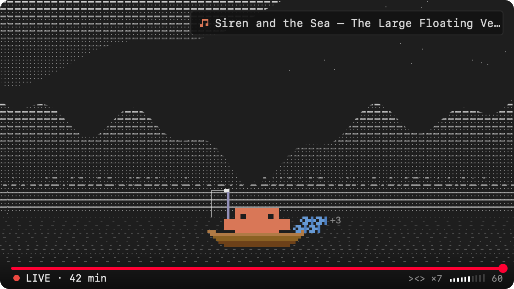

# lofi-radio

Claude FM, Anthropic's 24/7 lo-fi stream, inside Claude Code.



A Claude Code mod (a plugin of function hooks) that adds:

- a button above the prompt that starts the radio,
- a player pane drawn like the stream: dotted mountains, a pine line, drifting water and Clawd fishing from his boat,
- the current track, read off the stream itself,
- a listening timer and a small catch: one fish for every Claude turn that finishes while the radio plays,
- volume control and a small always-on-top video window,
- `/lofi` to open the player and play, `/lofi stop` to stop.

By default it plays audio only, so there is no browser tab.

Unofficial, fan-made mod. Not affiliated with or endorsed by Anthropic.

## Requirements

- macOS (it uses Homebrew's paths, `pkill`, and macOS Vision for the track name)
- `brew install yt-dlp ffmpeg deno` (yt-dlp needs a JavaScript runtime such as Deno for full YouTube support)
- Keep yt-dlp current with `brew upgrade yt-dlp`. YouTube changes often break older versions.
- For the track name: the Xcode Command Line Tools (`xcode-select --install`). Without them the radio still plays and the pane shows the stream's tagline instead.
- Claude Code with plugin hooks (mods)

## Install

In a `claude` session in the terminal:

```
/plugin install lofi-radio --marketplace alkanalperen/lofi-radio
```

Or from the shell:

```
claude plugin marketplace add alkanalperen/lofi-radio
claude plugin install lofi-radio@lofi-radio
```

If the button above the prompt does not show up, restart Claude Code.

## Use

1. Click **♪ Play Claude FM** above the prompt, or run `/lofi`.
2. In the pane: **▶ Play / ■ Stop** (`p`), **−** / **+** for volume (`j` / `k`), **▣ Mini window** (`m`) for the video, and a link to the stream on YouTube.
3. Run `/lofi stop` to stop.

You can also just ask Claude: "put on some lofi", "turn it down", "what's playing?". The mod gives Claude a `lofi` tool with the same controls.

The player follows Claude Code's language setting, then the system locale. Set the plugin's `language` option to `en` or `tr` to choose.

## How it works

`yt-dlp` resolves `https://clau.de/radio` (the address `/radio` opens) to the live HLS stream. The stream has no audio-only format, so it picks 360p, the smallest format with AAC-LC audio, and `ffplay` plays it with `-nodisp`. A resolved address goes stale within minutes, so every start resolves a fresh one, and a stream that stops getting segments is resolved again by itself. Changing the volume or the window restarts `ffplay`; the old player keeps going until the new one is ready.

The track name exists only in the video. While the radio plays, a small macOS Vision helper (compiled once into `~/.cache/lofi-radio`) reads the stream's now-playing box: one frame every 90 seconds to notice a change, and a 28-second read to stitch the scrolling name when it does. That costs about 20 MB an hour.

## Credits

The pixel Clawd sprite comes from johnnyvizz's savvy-progress ([claude-kit](https://github.com/JohnnyVizz/claude-kit), MIT) by way of the agent-deck mod. Claude, Claude FM and the Clawd character belong to Anthropic.

The music on Claude FM is made by independent artists. The pane names the track; [earwitness.fyi](https://earwitness.fyi) also reads the ticker and credits the artists.

## License

MIT for the code. See [LICENSE](LICENSE) and [NOTICE](NOTICE).

## Türkçe

Claude FM'i Claude Code'un içinde çalan bir mod. Prompt'un üstündeki **♪ Claude FM çal** butonuna bas veya `/lofi` yaz. Panelde çalan şarkı, çal/durdur, ses ve mini pencere var. Arayüz Claude Code'un dil ayarını izler; eklentinin `language` ayarıyla `tr` seçebilirsin. Kurulum için önce `brew install yt-dlp ffmpeg deno`, sonra yukarıdaki `/plugin install` satırı. Resmi değil, Anthropic ile bağı yok.
